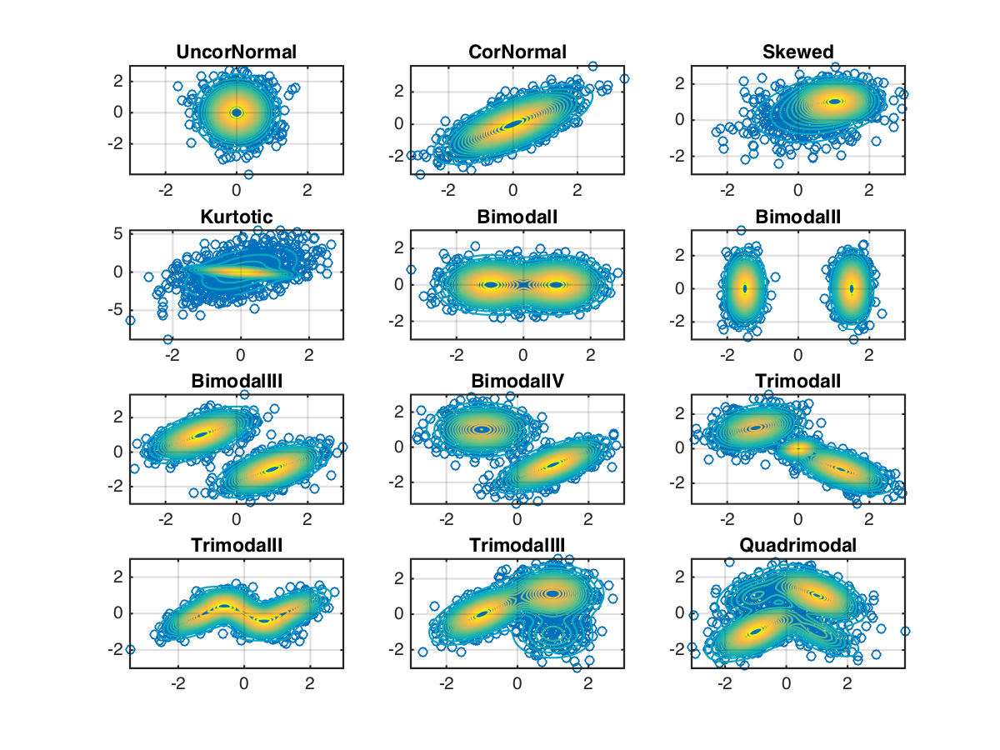
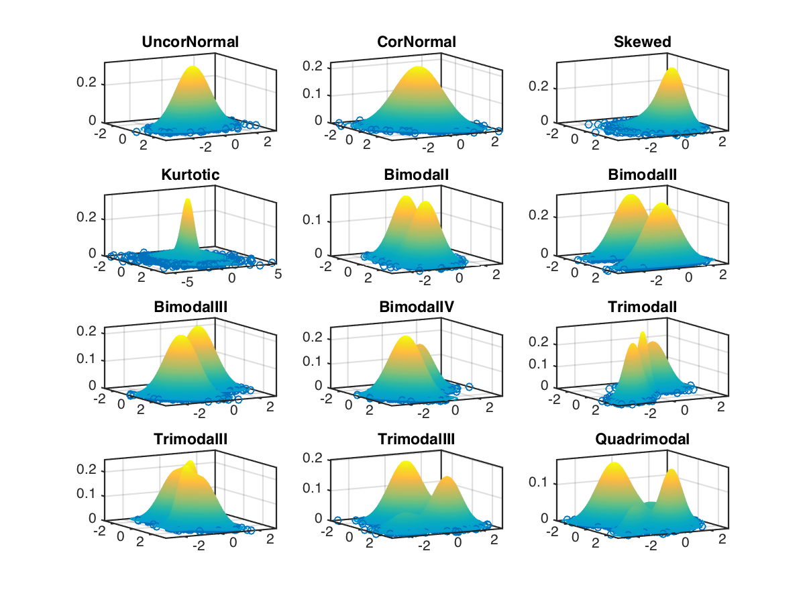

MakeDensity2d
=============

2-dimensional Normal Mixture Models for density estimation, clustering algorithms or bump hunting research and teaching purposes; providing the widely used Wand-Jones densities.

<a id="WandJones"/> M. P. Wand and M. C. Jones. **Comparison of Smoothing Parameterizations in Bivariate Kernel Density Estimation**. Journal of the American Statistical Association, 88(422), 1993.
